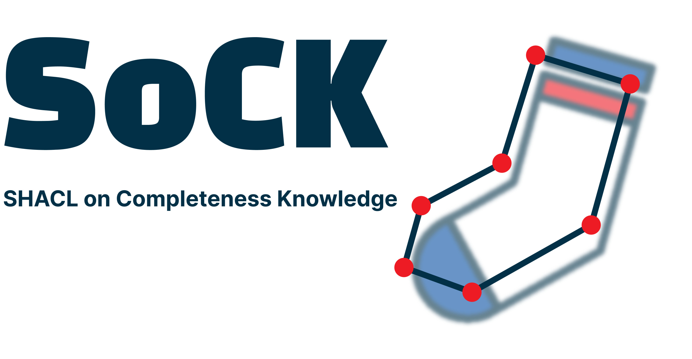
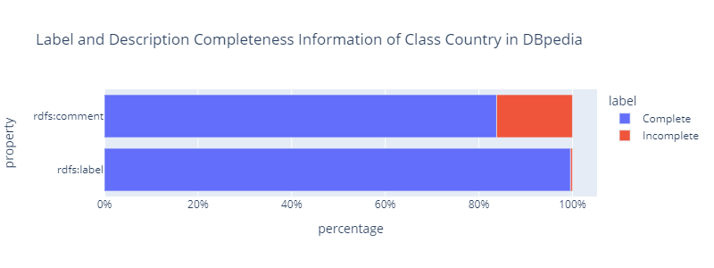

# Table of Contents
1. [Overview](#overview)
2. [Motivation](#motivation)
3. [Functions](#functions)
4. [How to Setup](#how-to-setup)
5. [Demonstration](#demonstration)
6. [Contributors](#contributors)

# Overview

<p align="center">
    
</p>

SoCK Library is a library to help user getting information about completeness of knowledge graph data. This library was developed with Python containing functions that can be used in the process of validating the completeness of the knowledge graph data. The functions available in this library are data collection, completeness pattern instantiation, data validation, and data visualization. Users are expected to be familiar with using Python to use this library properly. For now, this library is available only in **Notebook file** (.ipynb) and you can run it on [**Google Colab**](https://colab.research.google.com/) (there are some issues on querying SPARQL on Jupyter Notebook somehow).

The SoCK library reuses some of the existing Python libraries as **requirements**, such as:
- [RDFLib](https://rdflib.readthedocs.io/)
- [SPARQLWrapper](https://sparqlwrapper.readthedocs.io/)
- [PySHACL](https://pypi.org/project/pyshacl/)
- [Pandas](https://pandas.pydata.org/)
- [Plotly](https://plotly.com/python/)

# Motivation

SoCK Validator is part of the SoCK Framework project and part of our WOP 2022 paper entitled "SoCK: SHACL on Completeness Knowledge". This project exists because of the rapid development of knowledge graphs. However, it is not supported by a good data quality, especially in terms of completeness. Therefore, the SoCK framework was developed as a pattern-oriented framework to support the creation and validation about completeness in KGs. All the developed patterns and their instantiations can be accessed <a href="https://sock.cs.ui.ac.id" target="_blank"><b>here</b></a>. Happy exploring!

# Functions

There are several functions to perform completeness pattern instatiation and completeness validation.

- ```query_sparql```, performs query on a SPARQL endpoint.
- ```get_data_prop```, gets all the required properties for a validation process.
- ```construct_node_shape```, build a node shape.
- ```construct_property_shape```, build a property shape.
- ```construct_shapes_graph```, merge a node shape and a property shape to be a shapes graph as an instance of completeness pattern.
- ```build_data_graph```, constructs a data graph from all the collected data.
- ```validate_graph```, performs a SHACL validation based on a data graph and a shapes graph.
- ```create_report_validation```, converts validation report from a graph to a form of table.
- ```create_completeness_info_viz```, generates a visualization from table of validation report.

All the functions above are generally used consecutively. We prepare a demo to use this library with all those functions on [this section](#demonstration).

# How to Setup

1. Clone this repository
    ```cmd
    > git clone https://github.com/JillyCS15/sock-validator.git
    ```

2. Go to the Google Colab and sign up with your Google account.
3. Upload the Notebook file and just run it.

# Demonstration

**Example Use Case**

Given a user wants to check each instance of class ```dbo:Country``` in DBpedia has a label and description property. Then, he finds out the properties he should check out, that are ```rdfs:label``` for a label property and ```rdfs:comment``` for a description property they used.

1. First of all, we have to prepare a Python file to run all the codes. I recommend to use a Python Notebook file.

2.  Create an instance of a completeness pattern from [here](https://sock.cs.ui.ac.id/pattern/). Based on the use case, we choose a label and description completeness pattern. Here is the instantiation of its pattern using a manual approach. The shapes should be stored in ```shapes_graph``` variable.
    ```
    # prefixes

    ex:CountryShape
    a sh:NodeShape;
    sh:targetClass dbo:Country;
    sh:property [ a sh:PropertyShape;
        sh:path rdfs:label;
        sh:minCount 1 ];
    sh:property [ a sh:PropertyShape;
        sh:path rdfs:comment;
        sh:minCount 1 ].
    ```

3. Then, we collect all the data to be validated along with the required properties. At first you have to set up the query. According to the use case, we have to collect the entities from ```dbo:Country```. The query should be like this.

    ```
    SELECT DISTINCT ?entity
    WHERE {
        ?entity a dbo:Country .
    }
    LIMIT 100
    ```

    Don't forget to add the SPARQL endpoint and all the properties to be check (```rdfs:label``` and ```rdfs:comment```).

    ```python
    endpoint = "http://dbpedia.org/sparql"
    prop_list = ['rdfs:label', 'rdfs:comment']

    data = query_sparql(query, endpoint)
    data_prop = get_data_prop(data, prop_list, endpoint)
    ```

    After all the data is clear, we have to build data graph. You can check it on the cell code and the graph should be stored in ```data_graph``` variable.

4. Having the data graph and shapes graph, We are ready to run a validation process. We put the ```data_graph``` and ```shapes_graph``` as the input of the function ```validate_graph()```. The result is the report which the entities are not conform. we can adjust the use of SHACL advanced feature in the validation process by assigning a value (Boolean) to the variable ```use_advance_feat```.
    ```python
    # validate the data graph
    conforms, report_graph, report_text = validate_graph(shapes_graph, data_graph, use_advance_feat)
    ```

5. Then, we create a validation report in a form of table. We use ```create_report_validation``` to convert a validation report from a graph to a table form.
    ```python
    # create the completeness validation report
    validation = create_report_validation(data, "entity.value", report_graph, prop_list)
    ```

6. Lastly, we visualize the report to simplify the analysis and understanding process.
    ```python
    create_completeness_info_viz(
        validation,
        prop_list,
        'Label and Description Completeness Validation of ...')
    ```
    <p align="center">
        
    </p>

# Contributors

Thanks for all these great people from the **Faculty of Computer Science, Universitas Indonesia**, to contribute in this project:
- [Muhammad Jilham Luthfi](mailto:jilham.luthfi15@gmail.com)
- [Fariz Darari](mailto:fariz@ui.ac.id)
- [Amanda Carrisa Ashardian](mailto:amanda.carrisa@ui.ac.id)
